# 基于Java+Springboot+Vue的宿舍管理系统

## 一、系统介绍

目的: 提供一个宿舍管理的平台，方便学生使用和宿管管理   
用户：学生、宿管、超级管理员

### 1、学生：
登录、我的宿舍、申请调宿、报修申请、水电费管理、卫生检查、个人信息修改。

### 2、宿管：
登录、用户管理、宿舍管理、楼宇管理、维修管理、申请管理、访客管理、卫生检查、个人信息修改。

### 3、超级管理员：
包括宿管所有功能、宿管管理、水电费管理、公告信息管理。

## 二、所用技术
后端技术栈：
- Springboot
- SpringMvc
- mybatis plus
- mysql

前端技术栈：
- Vue3
- elementPlus
- vue-router
- axios

## 三、环境介绍
基础环境 :IDEA/eclipse, JDK 1.8, Mysql5.7及以上, Node.js(14.21), Maven3.6, Vscode

## 四、图片展示

### 1、登陆页面

### 2、学生页面

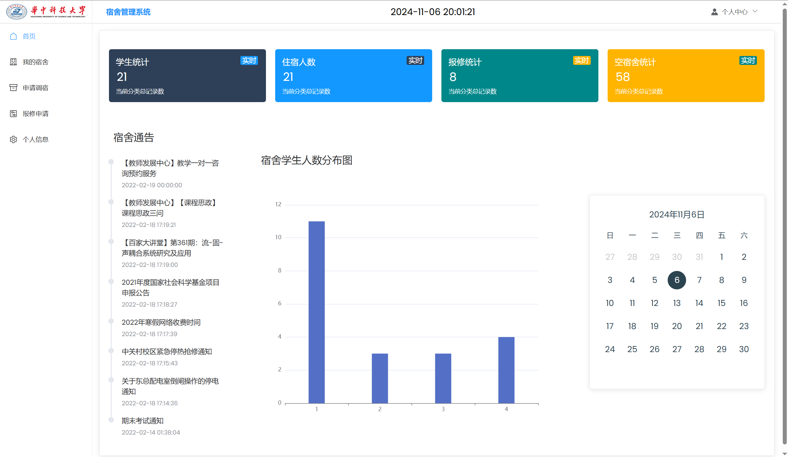
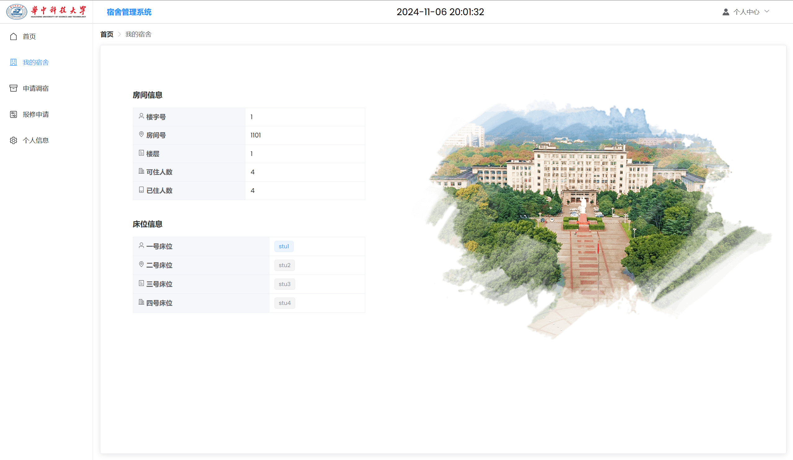
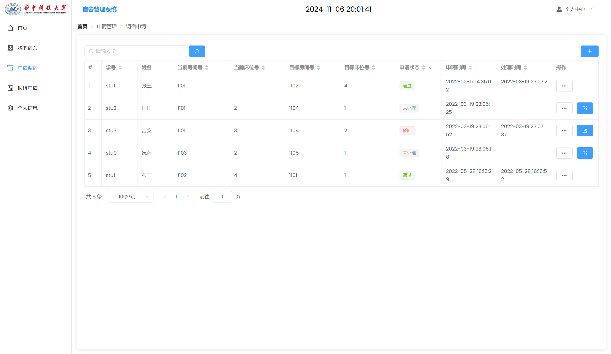
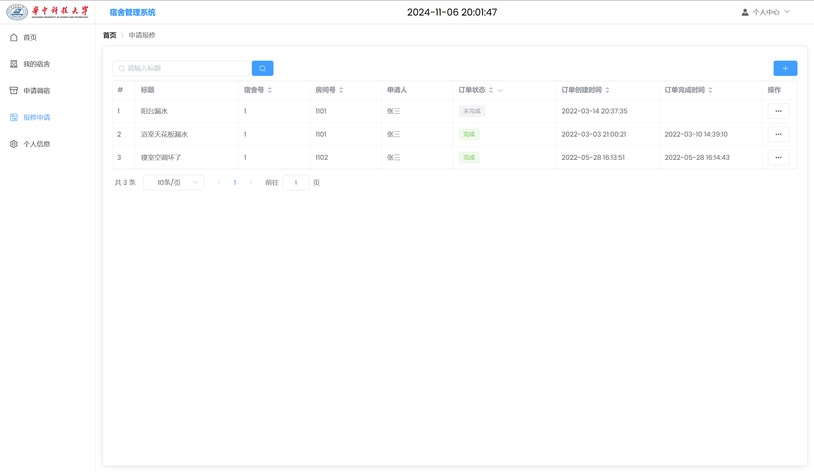
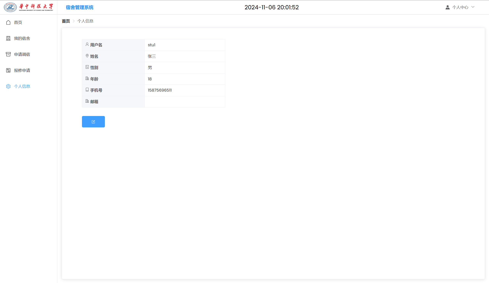
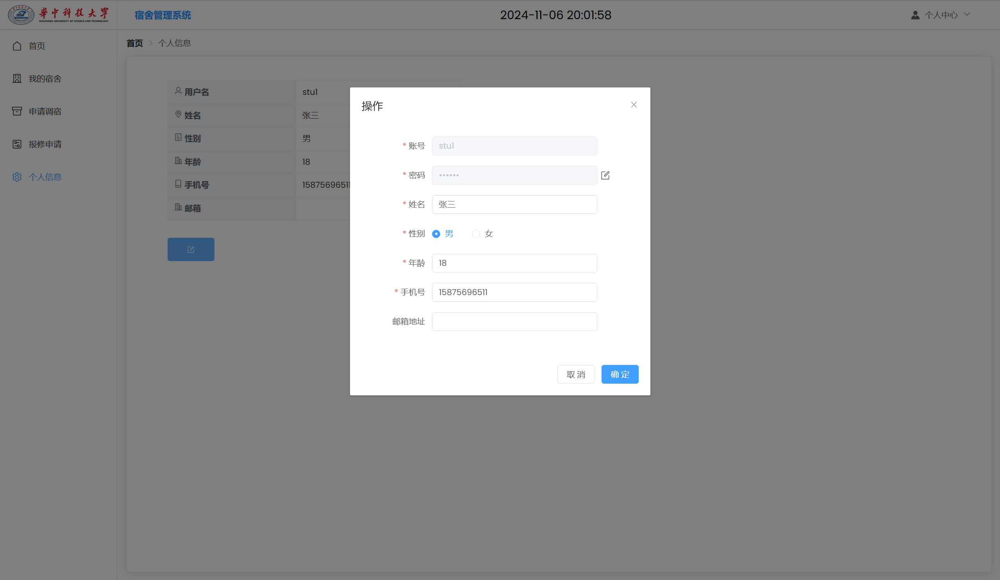

### 3、宿管页面

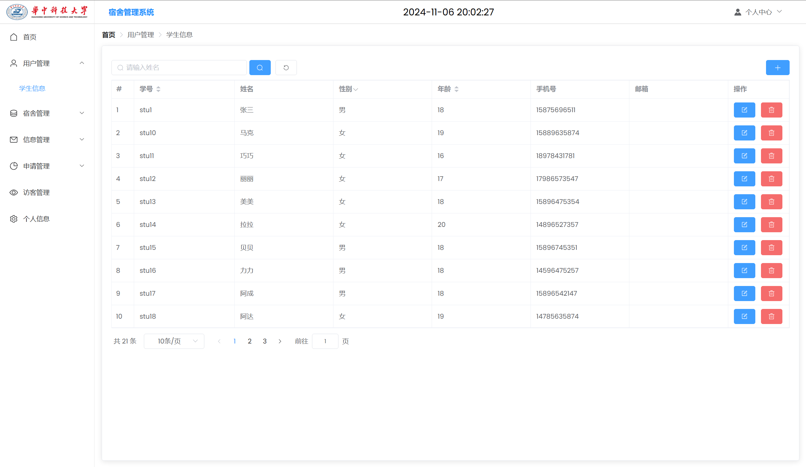
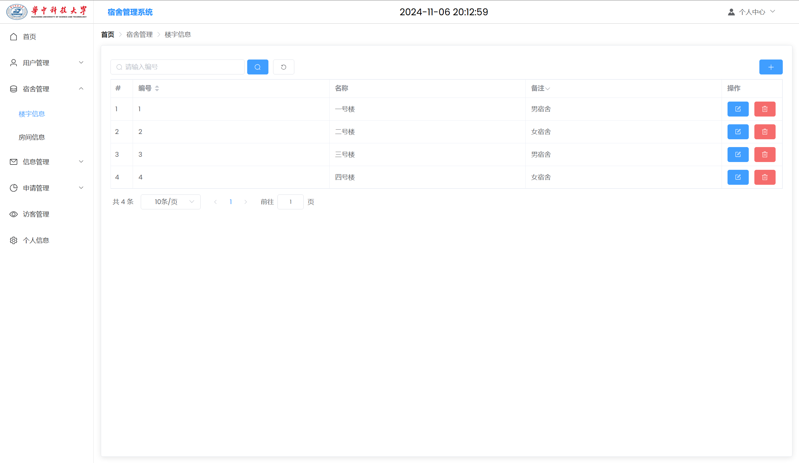
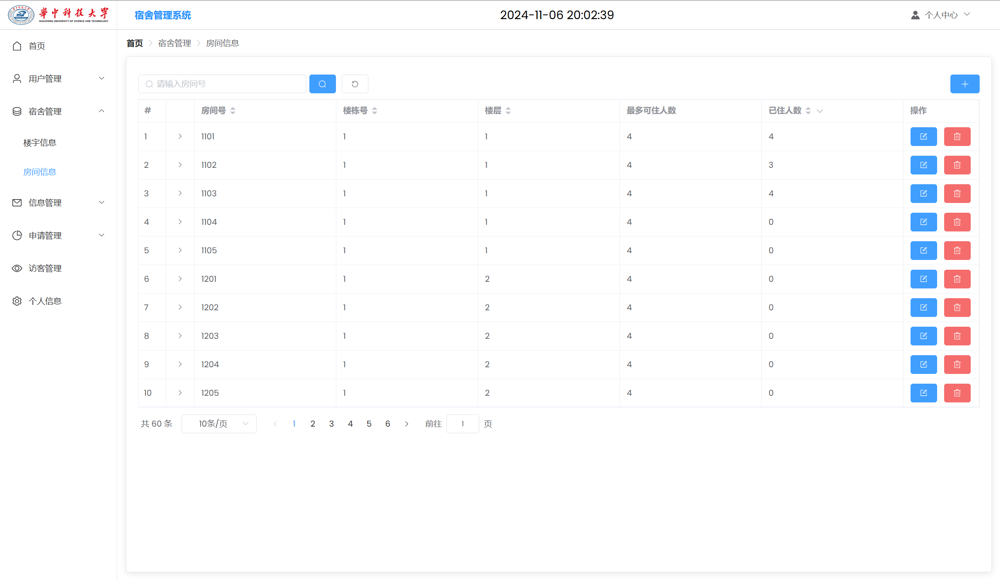
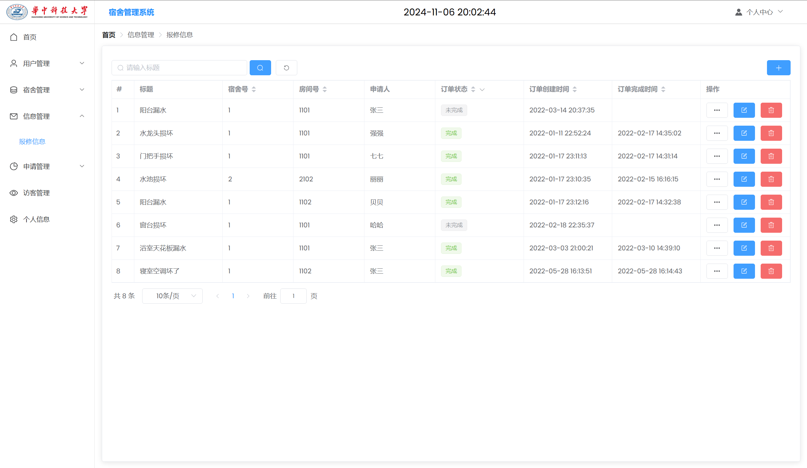
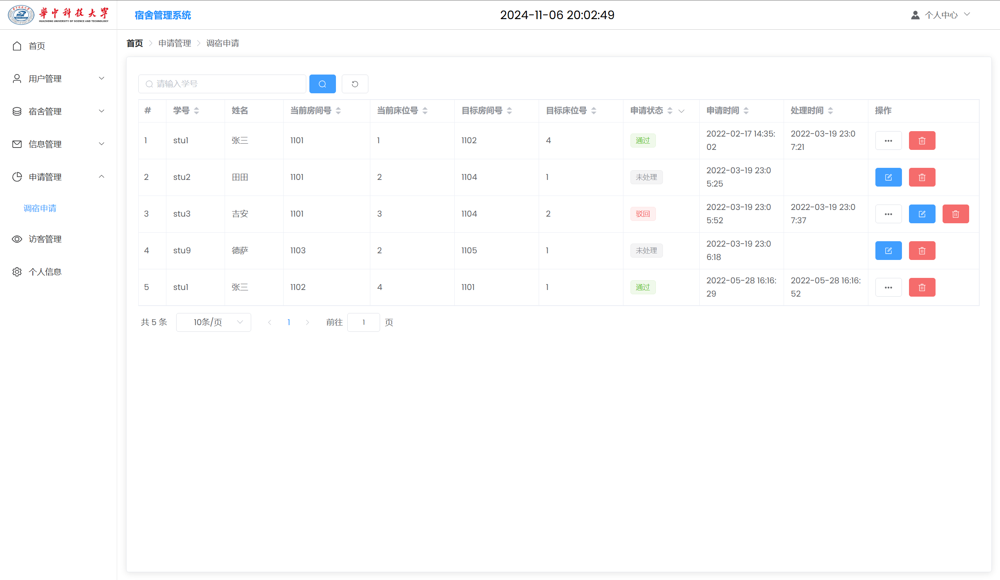
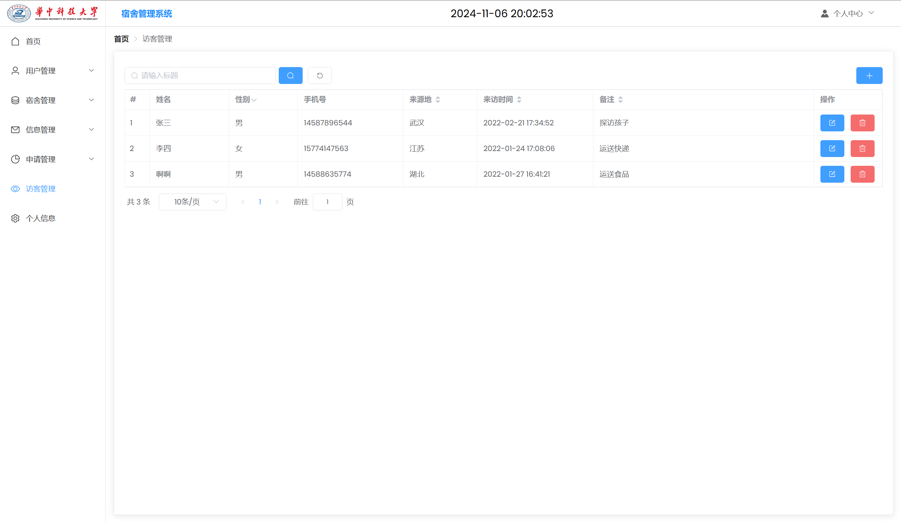

### 4、超级管理员页面

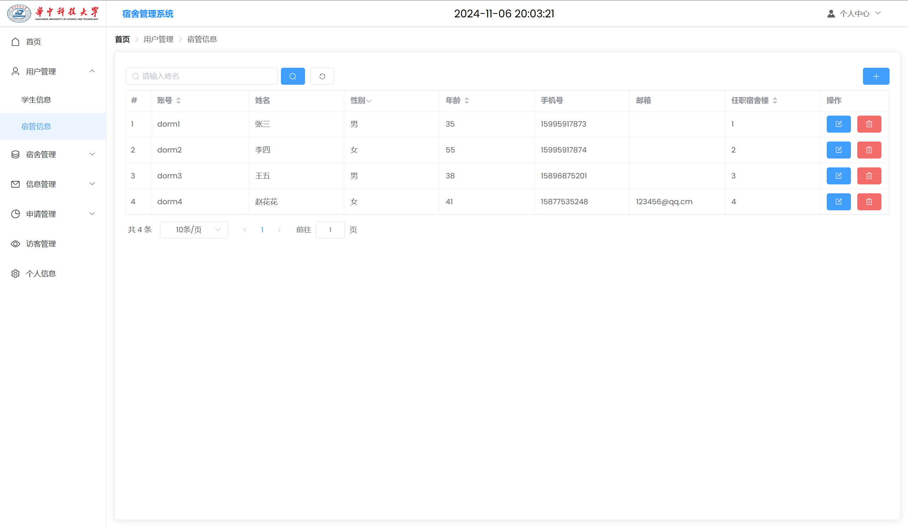
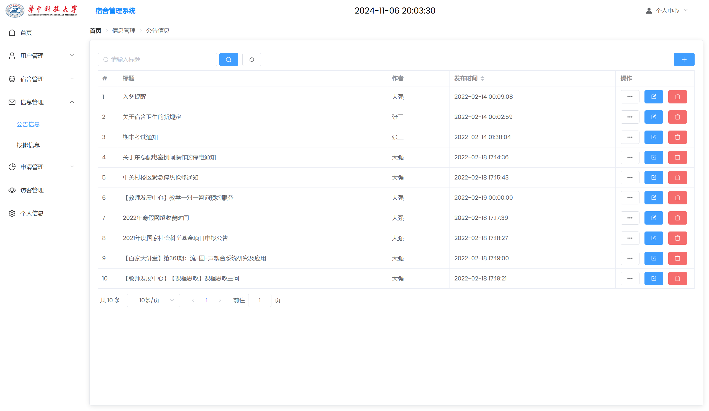

## 五、浏览地址
- http://localhost:8080/

超级管理员的账号密码为：admin/123456

宿舍管理员账号密码为：dorm1/123456

学生账号密码为：stu1/123456

## 六、安装教程

1. 使用Navicat或者其它工具，在mysql中创建对应名称的数据库，并执行项目的sql

2. 使用IDEA/Eclipse导入springboot项目，导入时，若为maven项目请选择maven; 等待依赖下载完成

3. 修改resources目录下面application.properties里面的数据库配置

4. com/homestay/homestay/HomestayApplication.java启动后端项目

5. vscode或idea打开vue项目

6. 在编译器中打开terminal，执行npm install 依赖下载完成后执行 npm run serve,执行成功后会显示前台访问地址

